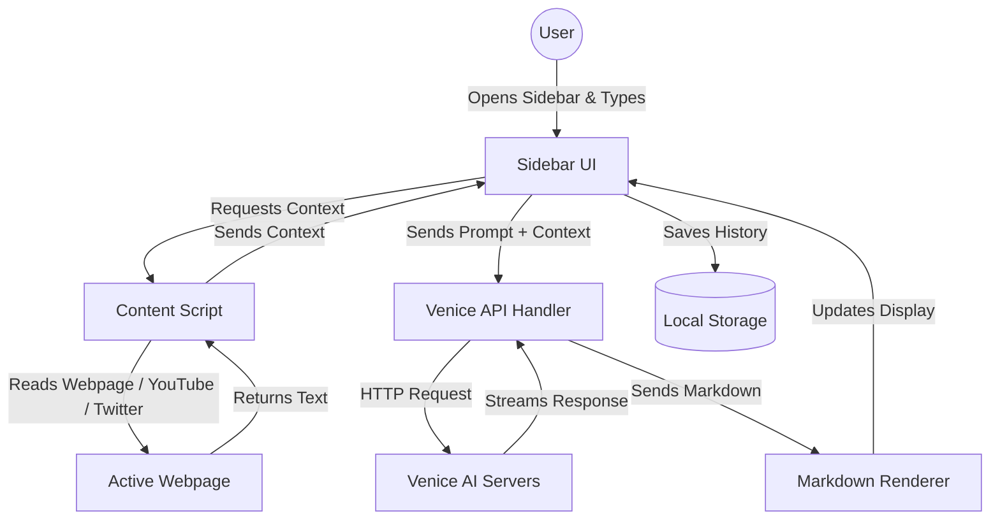

  
  <h1>Venice AI Assistant</h1>
  
<em>Your intelligent, context-aware companion for the modern web.</em>

  <!-- Badges -->
  
  
  
  

---

## 🚀 Elevate Your Browsing Experience

The **Venice AI Assistant** is a powerful, privacy-first Chrome Extension that brings the cutting-edge capabilities of Venice AI directly into your browser. Whether you're a developer debugging complex code, a researcher analyzing lengthy PDFs, or just someone looking to summarize a long YouTube video, Venice AI seamlessly integrates with your workflow. It reads the context of your active tabs, executes multi-step AI workflows, generates images, and even speaks to you—all from a sleek, non-intrusive sidebar.

---

## ✨ Feature Highlights

- 🧠 **Context-Aware Chat:** Instantly summarize articles, analyze Twitter/X threads, or extract YouTube transcripts (even bypassing restrictions) directly from your active tab.
- 📑 **Multi-Tab Mastery:** Select multiple open tabs at once and feed their combined content to the AI for comprehensive cross-referencing and research.
- 🔗 **Multi-Step Prompt Chains:** Automate complex workflows. Create chains like "Research Topic ➡️ Summarize Findings ➡️ Translate to Spanish" with a single click.
- 📚 **Knowledge Base (RAG):** Upload your own documents (PDF, DOCX, TXT, MD) and query them with AI using semantic search. The system extracts text, creates embeddings, and retrieves relevant context for accurate, source-cited answers.
- 🎨 **Image Generation:** Bring your ideas to life. Generate high-quality images directly within the chat interface using Venice AI's image models.
- 🗣️ **Text-to-Speech (TTS):** Listen to the AI's responses with natural-sounding voices, perfect for multitasking or accessibility.
- 📄 **PDF Superpowers:** Upload PDFs for the AI to read and analyze, and export your valuable chat conversations as beautifully formatted PDF documents.
- 🔒 **Privacy First:** Your chat history, custom prompts, and settings are stored securely in your browser's local storage.
- 🌗 **Beautiful UI:** A responsive, accessible design with seamless Light and Dark mode support, featuring real-time markdown rendering and code syntax highlighting.

---

## ⚡ Quick Start Guide

### Installation

1. **Download the Extension:** Clone this repository or download the latest release `.zip` file and extract it.
2. **Open Chrome Extensions:** Navigate to `chrome://extensions/` in your Google Chrome browser.
3. **Enable Developer Mode:** Toggle the "Developer mode" switch in the top right corner.
4. **Load Unpacked:** Click the "Load unpacked" button and select the extracted `Venice AI Assistant Chrome Extension` folder.
5. **Pin the Extension:** Click the puzzle piece icon in Chrome and pin Venice AI for easy access.

### Basic Usage

1. **Open the Sidebar:** Click the Venice AI icon in your toolbar or use the keyboard shortcut (`Ctrl+Shift+Y` on Windows/Linux, `Cmd+Shift+Y` on Mac).
2. **Add Your API Key:** Click the Settings gear icon (⚙️) in the sidebar and enter your Venice AI API key.
3. **Start Chatting:** 
   - Type a question in the chat box.
   - Click the "Current Page" button to let the AI read the article or video you're currently viewing.
   - Try asking: *"Summarize this page in 3 bullet points."*

---

## 🏗️ How It Works

The Venice AI Assistant uses a modern, lightweight architecture to securely connect your browser to the Venice AI API. Here is a high-level overview of the data flow:

* **Sidebar UI (`sidebar.js`):** The central hub where you interact with the AI.
* **Content Script (`content-script.js`):** The "eyes" of the extension, reading the text of the websites you visit.
* **Background Service (`background.js`):** Handles complex background tasks, like fetching YouTube transcripts securely.
* **Venice API Handler (`venice-api.js`):** Manages the secure connection to Venice AI for chat, images, and speech.

---

## 📚 Documentation

Want to dive deeper? Check out our comprehensive documentation:

- 📖 [**User Guide**](docs/USER_GUIDE.md): Detailed instructions on using advanced features like Prompt Chains and Multi-Tab Context.
- 🛠️ [**Technical Architecture**](docs/TECHNICAL_ARCHITECTURE.md): An in-depth look at the codebase, module interactions, and design patterns.
- 🤝 [**Contributing Guidelines**](docs/CONTRIBUTING.md): Learn how to set up your development environment and contribute to the project.

---

  
Built with ❤️ for the Venice AI community.

