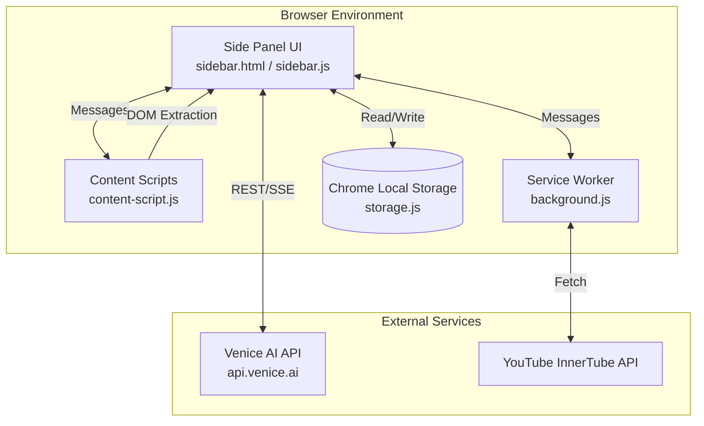
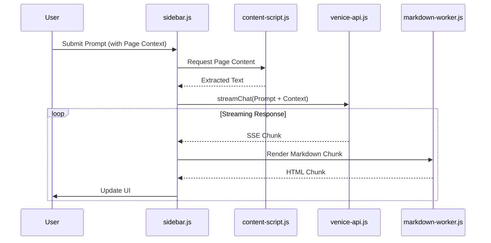
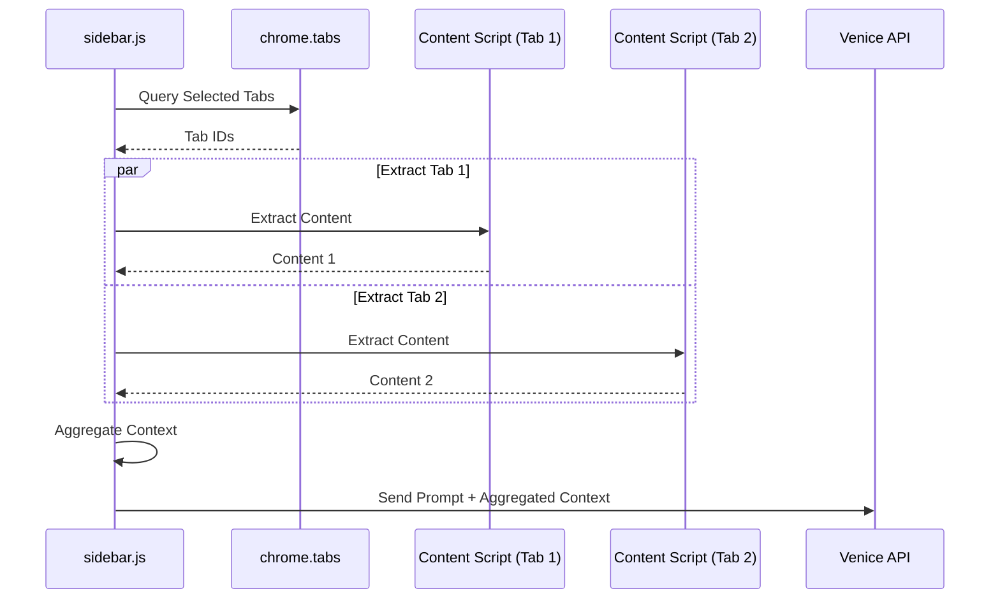

# Venice AI Assistant Chrome Extension - Technical Architecture

This document provides a comprehensive technical overview of the Venice AI Assistant Chrome Extension. It is intended for senior engineers and architects to understand the system's design, module interactions, data flow, and security posture.

## 1. System Architecture

The extension follows a standard Manifest V3 architecture, utilizing a Service Worker for background tasks, Content Scripts for DOM interaction, and a Side Panel for the primary user interface.



## 2. Module Breakdown

The system is modularized to separate concerns across UI rendering, state management, API communication, and DOM manipulation.

### Core Modules

*   **`sidebar.js` (Controller):** The central orchestrator. Manages UI state, handles user input, coordinates context gathering, and manages the chat lifecycle.
*   **`venice-api.js` (API Client):** Encapsulates all communication with the Venice AI API. Handles Server-Sent Events (SSE) for streaming chat completions, image generation, and chunked Text-to-Speech (TTS).
*   **`background.js` (Service Worker):** Handles cross-origin requests and bypasses CORS/CSP restrictions. Crucial for fetching YouTube transcripts via the internal InnerTube API.
*   **`content-script.js` (DOM Interactor):** Injected into active tabs to extract main article text, YouTube transcripts (via DOM or timedtext), and Twitter/X post data.
*   **`storage.js` (State Manager):** Wrapper around `chrome.storage.local` for persistent data (settings, conversation history, custom prompts).
*   **`chain-executor.js` (Workflow Engine):** Manages sequential execution of multi-step prompt chains, handling state passing between steps and API rate limiting.
*   **`markdown-worker.js` (Renderer):** Web Worker for non-blocking Markdown-to-HTML conversion, ensuring smooth UI performance during fast streaming responses.

### Module Interaction Flow



## 3. API Integration (Venice AI API)

The extension integrates heavily with the Venice AI API, primarily utilizing the `/chat/completions` endpoint for text generation.

*   **Streaming (SSE):** Chat responses are streamed using Server-Sent Events. `venice-api.js` parses the stream, specifically handling `<think>` tags for reasoning models, separating the thought process from the final response.
*   **Image Generation:** Utilizes the `/image/generate` endpoint.
*   **Text-to-Speech (TTS):** Handles long text by chunking it (`TextChunker`), making multiple requests to the TTS endpoint, and concatenating the resulting audio blobs (`AudioConcatenator`) for seamless playback.

## 4. Data Flow Diagrams

### 4.1 Prompt Chain Execution

Prompt chains allow for complex, multi-step workflows where the output of one step becomes the input for the next.

```mermaid
graph TD
    Start((Start Chain)) --> Step1[Execute Step 1]
    Step1 --> API1{Venice API}
    API1 -- Success --> Parse1[Parse Output 1]
    API1 -- Rate Limit --> Retry1[Exponential Backoff]
    Retry1 --> API1
    
    Parse1 --> Inject[Inject {previous_output} into Step 2 Prompt]
    Inject --> Step2[Execute Step 2]
    Step2 --> API2{Venice API}
    API2 -- Success --> Parse2[Parse Output 2]
    
    Parse2 --> End((End Chain / Final Output))
```

### 4.2 Multi-Tab Context Gathering

The extension can gather context from multiple open tabs simultaneously.



## 5. Extension Lifecycle

1.  **Installation/Update:** `manifest.json` is parsed. Service worker (`background.js`) is registered. Content scripts are injected into existing matching tabs.
2.  **Activation:** User clicks the extension icon or uses the shortcut (`Ctrl+Shift+Y` / `Cmd+Shift+Y`).
3.  **Initialization:** `sidebar.html` loads. `sidebar.js` initializes the `App` class, loads settings and history from `storage.js`, and establishes connection with the Web Worker (`markdown-worker.js`).
4.  **Execution:** User interacts with the UI. Messages are passed between the Sidebar, Content Scripts, and Service Worker as needed. API calls are made to Venice AI.
5.  **Suspension:** The Service Worker (`background.js`) goes idle after a period of inactivity to conserve resources, waking up when new messages are received. The Side Panel state is preserved as long as it remains open.

## 6. Security Considerations

*   **API Key Storage:** The Venice API key is stored in `chrome.storage.local`. While accessible to the extension, it is isolated from web pages. It is *not* synced via `chrome.storage.sync` to prevent exposure across devices if the user's Google account is compromised.
*   **Content Script Isolation:** Content scripts run in an "isolated world." They can read the DOM of the web page but cannot access the page's JavaScript variables or functions, preventing malicious scripts on the page from interfering with the extension or stealing the API key.
*   **Cross-Origin Resource Sharing (CORS):** The Service Worker (`background.js`) is used to bypass CORS restrictions for specific tasks (like fetching YouTube transcripts via InnerTube) because background scripts have elevated privileges compared to content scripts or the side panel.
*   **Content Security Policy (CSP):** The extension adheres to Manifest V3 CSP rules. Inline scripts and `eval()` are prohibited. The `print-page.html` uses a specific workaround (reading from `localStorage` and injecting) to allow printing dynamically generated HTML without violating CSP.
*   **Sanitization:** While `markdown-renderer.js` converts markdown to HTML, care must be taken to ensure that any user-provided or AI-generated content is properly sanitized before being injected into the DOM via `innerHTML` to prevent Cross-Site Scripting (XSS) attacks within the extension's context.
