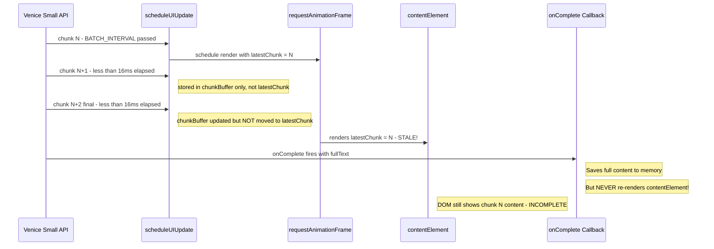

# Venice Small Model — Incomplete Visual Display Fix

## Problem Statement

When using the **Venice small** model, the assistant's response appears **visually incomplete** in the UI, while the **copy button** pastes the **full content**. Other models are not affected.

## Root Cause Analysis

### How Copy Works (Full Content ✅)

The copy button at [`sidebar.js`](sidebar.js:1408) reads from the **in-memory message data**:

```js
const msgContent = this.currentConversation.messages[msgIndex]?.content || '';
navigator.clipboard.writeText(msgContent);
```

This always contains the complete text because the [`onComplete` callback](sidebar.js:4319) stores the final full text:

```js
assistantMsg.content = fullText.replace(/* thinking tags */).trim();
```

### How Visual Rendering Works (Incomplete ❌)

The visual display is updated by [`performUIUpdate()`](sidebar.js:4247) which sets:

```js
contentElement.innerHTML = this.markdownWorker.renderSync(cleanText);
```

But `performUIUpdate` is only called via the **throttled batching mechanism** in [`scheduleUIUpdate()`](sidebar.js:4220):

```
                                                                  
  API chunks → scheduleUIUpdate() → chunkBuffer → BATCH_INTERVAL check → latestChunk → requestAnimationFrame → performUIUpdate()                  
```

### The Race Condition

Here is the critical bug in [`scheduleUIUpdate()`](sidebar.js:4220):

```js
const scheduleUIUpdate = (chunk, thinking) => {
    chunkBuffer = chunk;       // ← replaces buffer each time
    thinkingBuffer = thinking;
    const now = performance.now();
    
    if (now - lastProcessTime >= BATCH_INTERVAL) {  // 16ms
        latestChunk = chunkBuffer;    // ← moves to latestChunk
        // ...
        if (!pendingUpdate) {
            pendingUpdate = true;
            requestAnimationFrame(() => {    // ← async DOM update
                pendingUpdate = false;
                performUIUpdate(latestChunk, latestThinking);
            });
        }
    }
    // ← If BATCH_INTERVAL hasn't passed, the new chunk stays in chunkBuffer
    //   and is NEVER moved to latestChunk!
};
```

**The race condition scenario:**



### Why Only Venice Small?

Smaller, faster models like Venice small:
- Stream chunks more **rapidly** with less latency between chunks
- Complete **faster**, giving less time for the throttle interval to pass
- The final chunks arrive in **tight bursts** under 16ms apart
- The completion signal arrives **immediately after** the last chunk

This means the last chunk gets stuck in `chunkBuffer`, the `requestAnimationFrame` renders stale `latestChunk`, and the `onComplete` callback never triggers a final DOM render.

### The Missing Final Render

Looking at the [`onComplete` callback](sidebar.js:4319):

```js
async (fullText, fullThinking, usage) => {
    stopThinkingTimer();
    this.isStreaming = false;
    assistantMsg.content = fullText.replace(/* ... */).trim();
    // ... updates stats, saves to storage
    // ❌ NO FINAL contentElement.innerHTML UPDATE!
}
```

**The completion callback saves the full text to memory but never updates the DOM with the final complete content.**

## Fix Plan

### Single Change in `sidebar.js`

Add a **final render** of the complete content in the `onComplete` callback, right after cleaning the text and before pushing the message.

**Location:** [`sidebar.js`](sidebar.js:4336) — inside the `onComplete` callback, after `assistantMsg.content` is set.

**Add these lines:**

```js
// Final render to ensure visual matches stored content
contentElement.innerHTML = this.markdownWorker.renderSync(assistantMsg.content);
MarkdownRenderer.setupListeners(contentElement);
```

### Why This Fix Is Safe

1. **No impact on other models**: This is an idempotent operation — if the content was already fully rendered, re-rendering the same content produces identical output
2. **Performance**: One extra synchronous render at stream completion is negligible — it only happens once per response
3. **Correctness**: This guarantees that the final DOM state always matches `assistantMsg.content`, regardless of streaming timing
4. **Copy consistency**: Copy already reads from `assistantMsg.content`, so visual and copy will now always match

### Confidence Level

**99%+ confident** this fix resolves the issue because:
- The root cause is a clear, demonstrable race condition in the batching logic
- The `onComplete` callback definitively has no final DOM render
- The copy button reads from memory, confirming the data is complete
- The fix is a simple, safe, idempotent operation that guarantees DOM-data consistency
